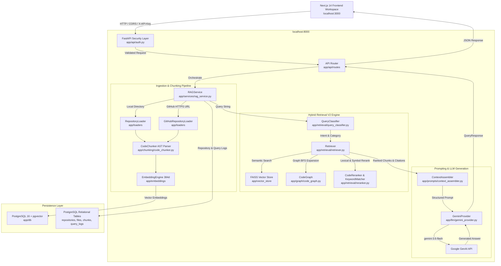
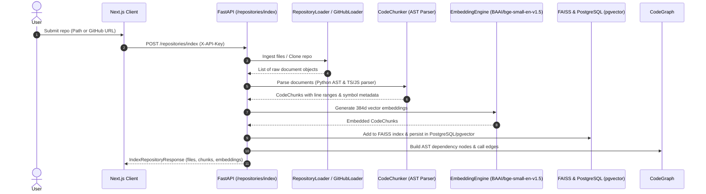
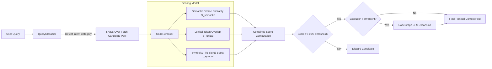
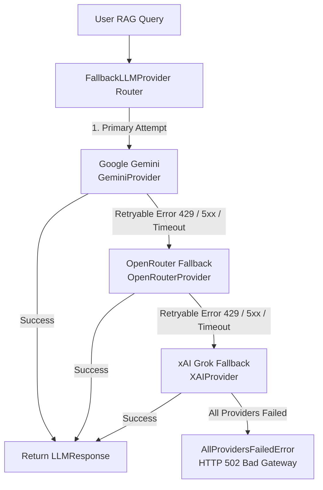

# DevMind AI Architecture Specification

DevMind AI is a code-aware Retrieval-Augmented Generation (RAG) system engineered for deep software codebase reasoning, semantic search, and architectural execution-flow tracing.

---

## 1. High-Level System Architecture

The following diagram illustrates the complete system architecture, spanning the Next.js frontend workspace, security layer, FastAPI orchestration service, hybrid retrieval engine, AST CodeGraph, PostgreSQL/pgvector persistence, and Gemini LLM provider:



---

## 2. Ingestion & Repository Indexing Pipeline

When a repository is submitted for indexing (via local folder path or GitHub HTTPS URL), DevMind AI executes the following ingestion pipeline:



### AST Structural Code Chunking
Unlike naive text splitters that break code arbitrarily by character or paragraph limits, `CodeChunker` ([app/chunking/code_chunker.py](file:///Users/huzefa/DevMind-AI/app/chunking/code_chunker.py)) extracts structural AST units:
- **Python Code**: Uses native Python `ast` module to extract top-level functions (`FunctionDef`), async functions (`AsyncFunctionDef`), classes (`ClassDef`), methods, and file-level imports/calls.
- **TypeScript / JavaScript Code**: Uses regex-based structural parsing supporting named imports (`import { X }`), default imports, aliased imports, namespace imports, async functions, arrow functions, methods, re-exports (`export { X }`), and call expressions.
- **Metadata Annotation**: Each chunk is annotated with `start_line`, `end_line`, `symbol_name`, `imports`, `imported_symbols`, `exported_symbols`, `function_calls`, and `repository_name`.

---

## 3. RAG V2 Retrieval & Reranking Methodology

DevMind AI uses a hybrid search and reranking algorithm to locate relevant code chunks:



### Hybrid Scoring Formula

$$\text{Final Score} = (w_{\text{semantic}} \cdot S_{\text{semantic}}) + (w_{\text{lexical}} \cdot S_{\text{lexical}}) + (w_{\text{symbol}} \cdot I_{\text{symbol}})$$

Where:
- $S_{\text{semantic}}$: Normalized cosine similarity score calculated by FAISS ($[0.0, 1.0]$).
- $S_{\text{lexical}}$: Token overlap ratio computed by `KeywordMatcher` ($[0.0, 1.0]$).
- $I_{\text{symbol}}$: Binary boost signal ($1.0$ if the query matches `symbol_name` or `file_path`, else $0.0$).
- Default weights: $w_{\text{semantic}} = 0.65$, $w_{\text{lexical}} = 0.25$, $w_{\text{symbol}} = 0.10$.
- Similarity Threshold: Candidates with a final score below `0.25` are automatically filtered out.

---

## 4. AST CodeGraph Architecture

`CodeGraph` ([app/graph/code_graph.py](file:///Users/huzefa/DevMind-AI/app/graph/code_graph.py)) constructs an in-memory directed dependency graph for multi-hop execution tracing:

- **Node Types**:
  - `FILE`: Source file paths (e.g., `lib/verification/engine.ts`).
  - `CLASS`: Object classes and interfaces (e.g., `VerificationEngine`).
  - `FUNCTION`: Standalone and member functions (e.g., `calculateScore`).
  - `API_ROUTE`: HTTP API handlers (e.g., `POST /api/verify`).
  - `PRISMA_MODEL`: Database entity models (e.g., `Achievement`).
- **Edge Types**: `IMPORTS`, `DEFINES`, `CALLS`, `ROUTE_CALLS`.
- **Graph BFS Expansion**: When `QueryClassifier` detects an `EXECUTION_FLOW` intent (e.g. *"Trace submission to database storage"*), the retriever triggers a Breadth-First Search (BFS) starting from retrieved entry nodes up to depth `N=2`, retrieving connected implementation files that semantic search alone might miss.

---

## 5. Security & Authentication Architecture

DevMind AI enforces multi-tenant repository isolation and API security:

- **Header Security**: Protected endpoints (`POST /query`, `POST /repositories/index`) require `X-API-Key`.
- **Constant-Time Comparison**: Key validation uses `hmac.compare_digest` in [app/api/auth.py](file:///Users/huzefa/DevMind-AI/app/api/auth.py) to eliminate timing attack vulnerabilities.
- **Fail-Closed Production Policy**: In production (`DEVMIND_ENV=production`), unconfigured API keys result in `HTTP 500 Server Security Misconfiguration`.
- **Multi-Tenant Repository Isolation**: Vector search (`FAISSVectorStore.search`) and CodeGraph lookups filter candidates by `repository_name` to prevent cross-repository retrieval contamination.
- **CORS Protection**: Configurable origins (`CORS_ORIGINS`) allow explicit cross-origin access for trusted frontend hosts.

---

## 6. Multi-Provider AI Fallback Architecture

To eliminate single-provider failure risks (rate limits, quota exhaustion, 5xx gateway drops), DevMind AI implements a prioritized three-tier fallback router ([app/llm/fallback_router.py](file:///Users/huzefa/DevMind-AI/app/llm/fallback_router.py)):



### Fallback Characteristics
- **Prioritized Execution**: Gemini is always tried first. When healthy, requests return immediately with zero fallback evaluation overhead.
- **Selective Transient Retries**: Only retryable errors (`RetryableProviderError`) trigger subsequent providers:
  - HTTP `429` (Rate Limit / Quota Exceeded)
  - HTTP `500`, `502`, `503`, `504` (Upstream Gateway and Service Errors)
  - Network timeouts (`httpx.TimeoutException`, socket errors)
  - Connection drops (`httpx.NetworkError`)
- **Deterministic Fast-Fail**: Non-retryable errors (`NonRetryableProviderError`, e.g., 400 Bad Request) fail immediately without cycling through providers.
- **Graceful Unconfigured Skipping**: Providers without active API keys in the environment are skipped cleanly during initialization and routing.
- **Metadata Transparency**: `LLMResponse.provider` and `LLMResponse.model` dynamically reflect the specific provider and model that generated the answer.

---

## 7. Vector Embedding Architecture & Model Isolation

DevMind AI maintains a strict separation between its LLM fallback routing and its vector embedding subsystems:

```
LLM Generation Fallback (Dynamic Multi-Provider):
  Gemini 2.5 Flash  -->  OpenRouter (gpt-4o-mini)  -->  xAI Grok (grok-2-latest)

Vector Embeddings (Isolated Latent Coordinate Spaces):
  Production:            Google Gemini (`gemini-embedding-2`, 768 dimensions)
  Development / Testing: Local FastEmbed (`BAAI/bge-small-en-v1.5`, 384 dimensions)
```

### Critical Embedding Invariance Rules
1. **Zero Cross-Space Vector Contamination**: Latent coordinate spaces from different embedding models (e.g. BGE-small 384d vs Gemini Embedding 2 768d) are mathematically non-interchangeable. Inner products across different embedding models produce meaningless random noise.
2. **Repository-Level Embedding Metadata**: Each indexed repository stores its `embedding_provider`, `embedding_model`, and `embedding_dimension` in the database.
3. **Strict Query Consistency**: Query embeddings must always use the exact provider and dimension with which the repository was indexed. If a query arrives with a mismatched embedding provider/dimension or if repository chunks were invalidated (NULL) by database migration, DevMind AI fails fast with `RepositoryNotIndexedError`, requiring explicit re-indexing.
4. **No Silent Fallbacks**: There is never automatic fallback between Gemini embeddings and local BGE embeddings. If Gemini embedding requests fail, the indexing job halts with clear diagnostics rather than polluting the index with heterogeneous vectors.
5. **Database Migration & Re-indexing Requirement**: Following migration to 768 dimensions (Alembic revision `004_embedding_dim_768`), existing 384d chunk vectors are safely invalidated (`embedding = NULL`) to prevent cross-space corruption. All production repositories must be re-indexed under `gemini-embedding-2`.

---

## 8. Multi-Tenant RAG Retrieval Safety & Persistence Architecture

DevMind AI implements strict multi-tenant isolation and persistent vector retrieval to guarantee zero cross-repository or cross-user context leakage.

### Elimination of Global In-Memory Vector Store
Historically, RAG services cached a single in-memory FAISS index representing the most recently indexed repository (`RAGService.vector_store`). Under multi-user concurrency, this represented a critical security vulnerability: querying users could retrieve vectors belonging to whichever repository was most recently indexed or queried by another tenant.

DevMind AI eliminates this vulnerability through the following architectural principles:

1. **PostgreSQL + pgvector as Authoritative Persistent Retrieval Layer**:
   - Chunks and embeddings are persisted directly in PostgreSQL with `pgvector`.
   - Vector search is executed natively in the database with strict repository scoping:
     ```sql
     SELECT c.id, c.file_id, c.chunk_text, c.start_line, c.end_line,
            c.symbol_name, c.embedding <=> :query_vector AS distance
     FROM chunks c
     JOIN files f ON c.file_id = f.id
     WHERE f.repository_id = :repository_id
       AND c.embedding IS NOT NULL
     ORDER BY distance ASC
     LIMIT :top_k;
     ```
   - The database query is strictly scoped to `files.repository_id == :repository_id` *before* similarity ranking, ensuring vectors from other repositories are never evaluated or returned.

2. **Authentication & Resource-Safe Ownership Resolution**:
   - Every query resolves the target repository against the authenticated user:
     `get_repository_by_name(db, repo_name, user_id=user_id)`
   - If the repository does not exist or belongs to another user, DevMind AI returns a resource-safe `404 Not Found` (`RepositoryNotFoundError`), preventing repository enumeration and cross-user metadata leakage.
   - Target repository resolution follows a clear precedence: explicit query `repository_name` $\rightarrow$ conversation-bound `repository_name` $\rightarrow$ fallback error.

3. **Stateless & Thread-Safe Retrieval Flow**:
   - Retrieval operations do not mutate global or service-level state.
   - Concurrent requests targeting different repositories execute in complete isolation without race conditions or index clobbering.

4. **Strict Memory Boundedness (512 MB RAM Target)**:
   - Avoids maintaining unbounded `dict[repository_id, FAISSIndex]` structures in process memory.
   - Embeddings are queried from disk/database index on-demand, keeping DevMind AI's runtime memory footprint strictly bounded and resilient under production loads.
   - FAISS remains an optional, local acceleration and development backend rather than a global singleton.
