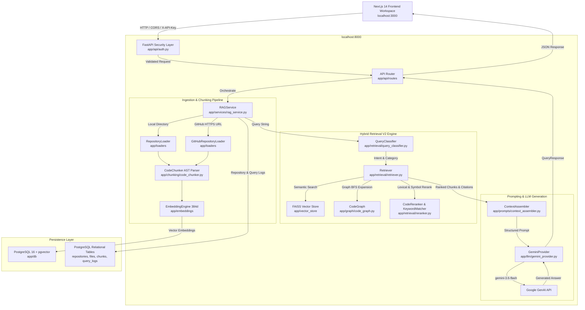
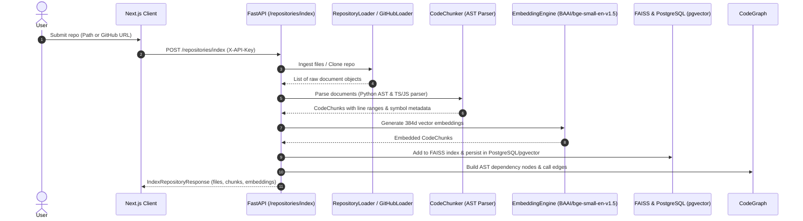
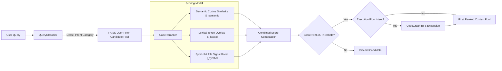

# DevMind AI Architecture Specification

DevMind AI is a code-aware Retrieval-Augmented Generation (RAG) system engineered for deep software codebase reasoning, semantic search, and architectural execution-flow tracing.

---

## 1. High-Level System Architecture

The following diagram illustrates the complete system architecture, spanning the Next.js frontend workspace, security layer, FastAPI orchestration service, hybrid retrieval engine, AST CodeGraph, PostgreSQL/pgvector persistence, and Gemini LLM provider:

---

## 2. Ingestion & Repository Indexing Pipeline

When a repository is submitted for indexing (via local folder path or GitHub HTTPS URL), DevMind AI executes the following ingestion pipeline:

### AST Structural Code Chunking
Unlike naive text splitters that break code arbitrarily by character or paragraph limits, `CodeChunker` ([app/chunking/code_chunker.py](file:///Users/huzefa/DevMind-AI/app/chunking/code_chunker.py)) extracts structural AST units:
- **Python Code**: Uses native Python `ast` module to extract top-level functions (`FunctionDef`), async functions (`AsyncFunctionDef`), classes (`ClassDef`), methods, and file-level imports/calls.
- **TypeScript / JavaScript Code**: Uses regex-based structural parsing supporting named imports (`import { X }`), default imports, aliased imports, namespace imports, async functions, arrow functions, methods, re-exports (`export { X }`), and call expressions.
- **Metadata Annotation**: Each chunk is annotated with `start_line`, `end_line`, `symbol_name`, `imports`, `imported_symbols`, `exported_symbols`, `function_calls`, and `repository_name`.

---

## 3. RAG V2 Retrieval & Reranking Methodology

DevMind AI uses a hybrid search and reranking algorithm to locate relevant code chunks:

### Hybrid Scoring Formula

$$\text{Final Score} = (w_{\text{semantic}} \cdot S_{\text{semantic}}) + (w_{\text{lexical}} \cdot S_{\text{lexical}}) + (w_{\text{symbol}} \cdot I_{\text{symbol}})$$

Where:
- $S_{\text{semantic}}$: Normalized cosine similarity score calculated by FAISS ($[0.0, 1.0]$).
- $S_{\text{lexical}}$: Token overlap ratio computed by `KeywordMatcher` ($[0.0, 1.0]$).
- $I_{\text{symbol}}$: Binary boost signal ($1.0$ if the query matches `symbol_name` or `file_path`, else $0.0$).
- Default weights: $w_{\text{semantic}} = 0.65$, $w_{\text{lexical}} = 0.25$, $w_{\text{symbol}} = 0.10$.
- Similarity Threshold: Candidates with a final score below `0.25` are automatically filtered out.

---

## 4. AST CodeGraph Architecture

`CodeGraph` ([app/graph/code_graph.py](file:///Users/huzefa/DevMind-AI/app/graph/code_graph.py)) constructs an in-memory directed dependency graph for multi-hop execution tracing:

- **Node Types**:
  - `FILE`: Source file paths (e.g., `lib/verification/engine.ts`).
  - `CLASS`: Object classes and interfaces (e.g., `VerificationEngine`).
  - `FUNCTION`: Standalone and member functions (e.g., `calculateScore`).
  - `API_ROUTE`: HTTP API handlers (e.g., `POST /api/verify`).
  - `PRISMA_MODEL`: Database entity models (e.g., `Achievement`).
- **Edge Types**: `IMPORTS`, `DEFINES`, `CALLS`, `ROUTE_CALLS`.
- **Graph BFS Expansion**: When `QueryClassifier` detects an `EXECUTION_FLOW` intent (e.g. *"Trace submission to database storage"*), the retriever triggers a Breadth-First Search (BFS) starting from retrieved entry nodes up to depth `N=2`, retrieving connected implementation files that semantic search alone might miss.

---

## 5. Security & Authentication Architecture

DevMind AI enforces multi-tenant repository isolation and API security:

- **Header Security**: Protected endpoints (`POST /query`, `POST /repositories/index`) require `X-API-Key`.
- **Constant-Time Comparison**: Key validation uses `hmac.compare_digest` in [app/api/auth.py](file:///Users/huzefa/DevMind-AI/app/api/auth.py) to eliminate timing attack vulnerabilities.
- **Fail-Closed Production Policy**: In production (`DEVMIND_ENV=production`), unconfigured API keys result in `HTTP 500 Server Security Misconfiguration`.
- **Multi-Tenant Repository Isolation**: Vector search (`FAISSVectorStore.search`) and CodeGraph lookups filter candidates by `repository_name` to prevent cross-repository retrieval contamination.
- **CORS Protection**: Configurable origins (`CORS_ORIGINS`) allow explicit cross-origin access for trusted frontend hosts.
